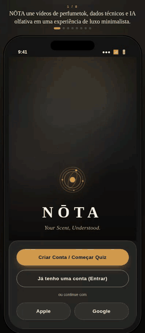

 

<!-- Logo / Banner -->

  

> *Ecossistema integrado de inteligência olfativa, comunidade e marketplace B2B/B2C para fragrâncias.*

 

---

### ✦ &nbsp; O Seu Aroma, Compreendido &nbsp; ✦

---

 

<!-- Badges -->

 

---

 

## 🗂 Sumário

 

| # | Seção | Descrição |
|:-:|:------|:----------|
| [01](#-sobre-o-projeto) | **Sobre o Projeto** | Visão geral, problema e solução |
| [02](#-equipe) | **Equipe** | As pessoas por trás do NŌTA |
| [03](#-protótipo-do-app) | **Protótipo do App** | Primeiras telas e fluxos de navegação |

 

---

 

## 01 · Sobre o Projeto

 

  

O **NŌTA** é uma plataforma multicanal que une inteligência artificial, comunidade e comércio em torno de um único universo: as fragrâncias.

O ecossistema é composto por um **aplicativo mobile voltado ao consumidor final** e um **portal web administrativo dedicado a marcas e casas de perfumaria**. Juntos, eles conectam quem ama perfumes a quem os cria — de forma técnica, sensorial e comercial.

 

### 🎯 O Problema

 

<table>
<tr>
<td width="50%" valign="top">

**Para o Consumidor**

A jornada de compra de perfumes é fragmentada entre redes sociais, enciclopédias técnicas e e-commerces. O alto risco financeiro das compras às cegas (*blind buy*) afasta pessoas que gostariam de explorar novos aromas, mas não têm um guia confiável.

</td>
<td width="50%" valign="top">

**Para Marcas & Casas de Perfumaria**

Dificuldade em alcançar públicos qualificados com base em compatibilidade real de notas olfativas. Falta de canais diretos para comercializar frações e decants oficiais, e poucos recursos para educar o mercado sobre novos lançamentos.

</td>
</tr>
</table>

 

### 💡 A Solução Integrada

 

<strong>📱 Aplicativo Mobile &nbsp;—&nbsp; B2C (Consumidor Final)</strong>

 

| Funcionalidade | Descrição |
|:--------------|:----------|
| **Feed "For You" Olfativo** | Resenhas em vídeo e foto com tags interativas e índice de compatibilidade (*Match %*) em tempo real |
| **Enciclopédia Completa** | Catálogo técnico com pirâmide olfativa (topo, coração e base), acordes e avaliações da comunidade |
| **O Alquimista (IA)** | Algoritmo para cálculo de compatibilidade de *layering* e consultor olfativo conversacional |
| **Decanteria & Shop** | Compra facilitada de frascos e decants (2ml, 5ml, 10ml) para testes sem risco financeiro |
| **Perfil & Armário** | Gestão de coleção pessoal (*Tenho*, *Desejo*, *Decants*) e mapeamento do DNA olfativo |

 

<strong>💻 Portal Web Partner &nbsp;—&nbsp; B2B (Marcas & Lojistas)</strong>

 

| Funcionalidade | Descrição |
|:--------------|:----------|
| **Gestão de Catálogo & Fichas Técnicas** | Cadastro e edição detalhada de fragrâncias com indexação automática na Enciclopédia global |
| **Marketplace & Vendas** | Painel de controle de estoque e precificação para frascos lacrados, amostras e decants oficiais |
| **Analytics Olfativo & Demanda** | Relatórios com métricas de interesse, notas em alta e taxa de conversão gerada pelo *Match Algorithm* |

 

---

 

## 02 · Equipe

 

*As mentes e mãos por trás do NŌTA.*

 

<table>
  <tr>
    <td align="center">
      <a href="https://github.com/HeloCris">
         
        <b>Helorrayne Cristine</b>
      </a>
    </td>
    <td align="center">
      <a href="https://github.com/LeticiaGLopes-151">
         
        <b>Letícia Gomes Lopes</b>
      </a>
    </td>
    <td align="center">
      <a href="https://github.com/luc4sm0ur4">
         
        <b>Lucas Moura</b>
      </a>
    </td>
    <td align="center">
      <a href="https://github.com/iohanan-cephas">
         
        <b>João Pedro O. Barbosa</b>
      </a>
    </td>
    <td align="center">
      <a href="https://github.com/nhangamona">
         
        <b>Mona</b>
      </a>
    </td>
  </tr>
</table>

 

---

 

## 03 · Protótipo do App

 

*Uma visão antecipada do ecossistema NŌTA em movimento.*

 

 

---

 

 

*NŌTA — Cada nota conta uma história.*

 

  

 

